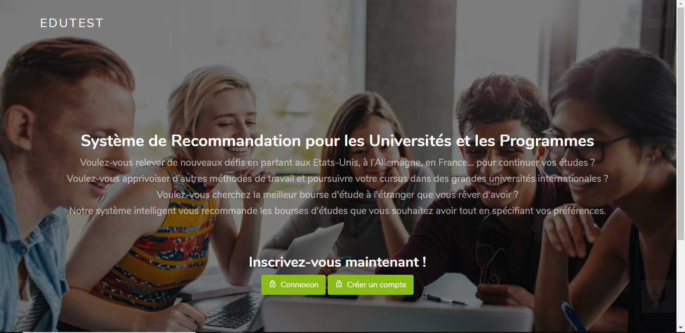

# Scholarships-and-Universities-Recommendation-System

In this project, we build a recommendation system for universities and scholarships. Based on unsupervised machine learning algorithms and web scraping, we perform a web application that allows students to get the most interesting internships and universities in the world according to their preferences.

**Main tasks :** 
- Data Scraping, Data preprocessing, Data cleaning, Data visualization
- Clustering using unsupervised Machine Learning models (K-means, DBSCAN,...)
- Development of a web application allowing students to get a scholarship recommendation according to their preferences and tests

📍 **Keywords** : Machine Learning, Web Scraping, BeautifulSoup, Data mining, NLP, Python, Numpy, Pandas, Scikit-learn, Django, Bootstrap, Scrum

📍 Screenshots:

📅 **Last Update On** : June 2020.

✉️ **Contact :**

email : ghassene.tanabene@gmail.com

linkedin : https://www.linkedin.com/in/ghassene-tanabene/
